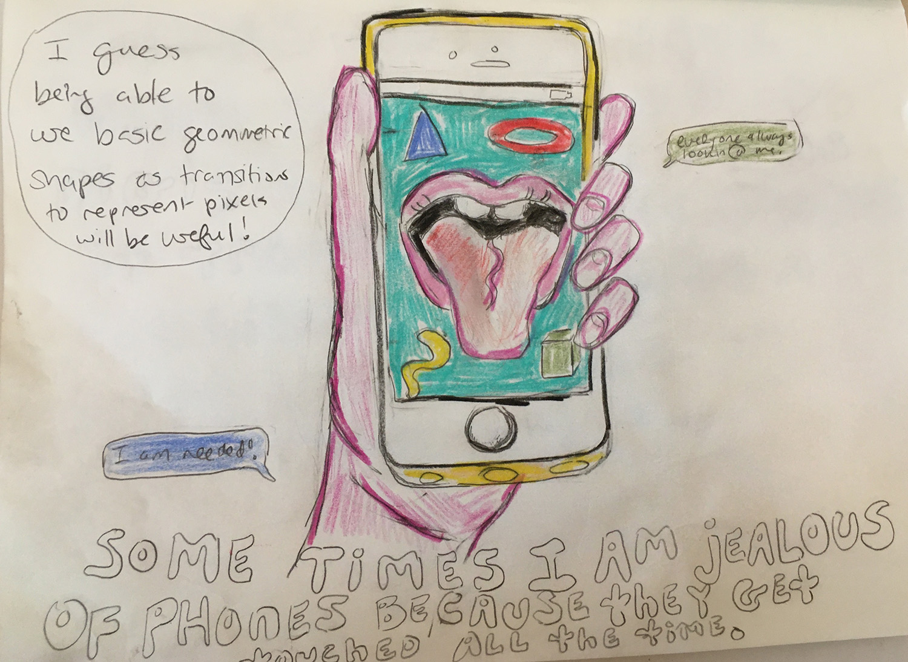
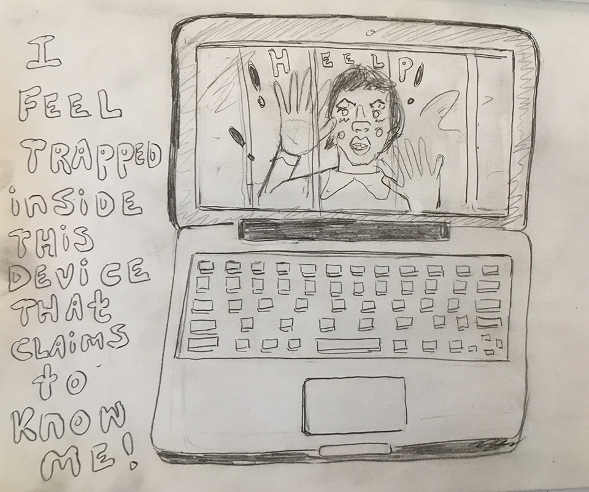
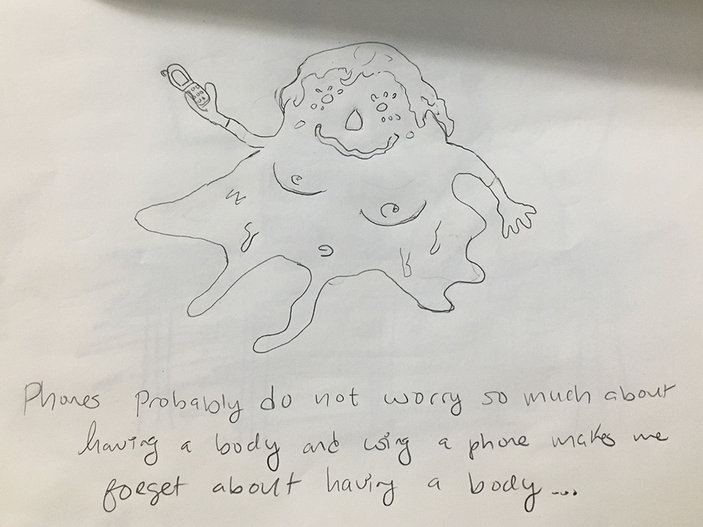

# Project Frames

## Project I

For the first project, I intend to **create a narrative around disembodiment and the constant desire for connection from the perspective of both humans and their devices, such as cellphones**.

 

In this case my audience is broad and could appeal to **all people who use phones or the internet primarily to connect with people**. 

 

I would like for people to imagine what it would be like if we had no bodies. In this regard, I am also thinking a lot about gendered bodies and how many people experience dysphoria. I want to speculate a future where we are able to modify our own bodies with ease and like water, take on many states. 

 
## Project II
I'm not sure still, but I may try to access data around the eviction crisis in NYC.
 
## Project III
I like the idea of making a game or interface for **building a collective Internet, where I provide building blocks for people to play with**. 

 

This game would specifically be for **marginalized communities to provide input on what an equitable, decentralized internet would look like**. 

 

The goal of this project would be to start building multiple internets, where people can feel like they have autonomy and are not under surveillance.
 
 

Right now, I can see some of interactions a of a user being drawing paths with their mouse to connect computers / users with other users across the globe, creating a web of different online identities. 

### Assignment 3 Documentation

