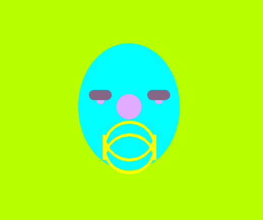
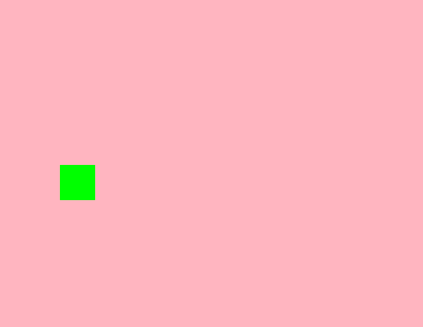
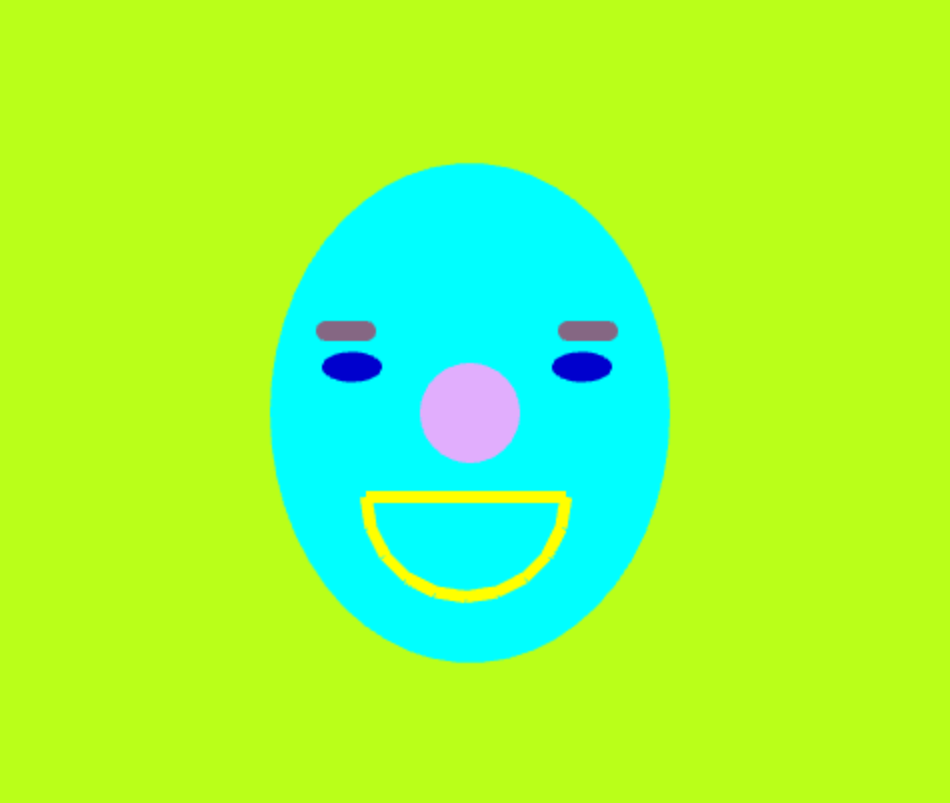
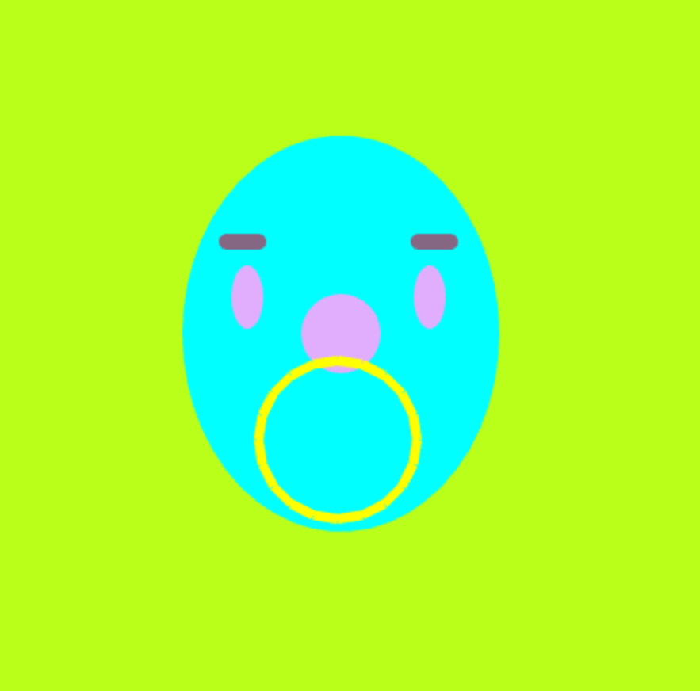

## Sounds & Polygons

### Progress

> Here is what I have. It is flawed, but I tried. I will update as I get closer to the correct version. 

This week I converted all the faces I drew from last week into Vectors.
I also made all the mouth parts into polylines. 

I am still working through the logic of animating between the facial positions. I am not sure what the best set up to move between positions is. Here is my failed attempt:

I finally understood how to make a rectangle bounce from one end of the screen to the other and then back again. 

I imagine to move the parts of the face (eyebrow width, height; eyeball width,height; and mouth width, height) I would do a similar equation to 
but the distance moved would be less.  

### TO DO:
animate the positions of faces better
make the sounds change as the faces change. 

