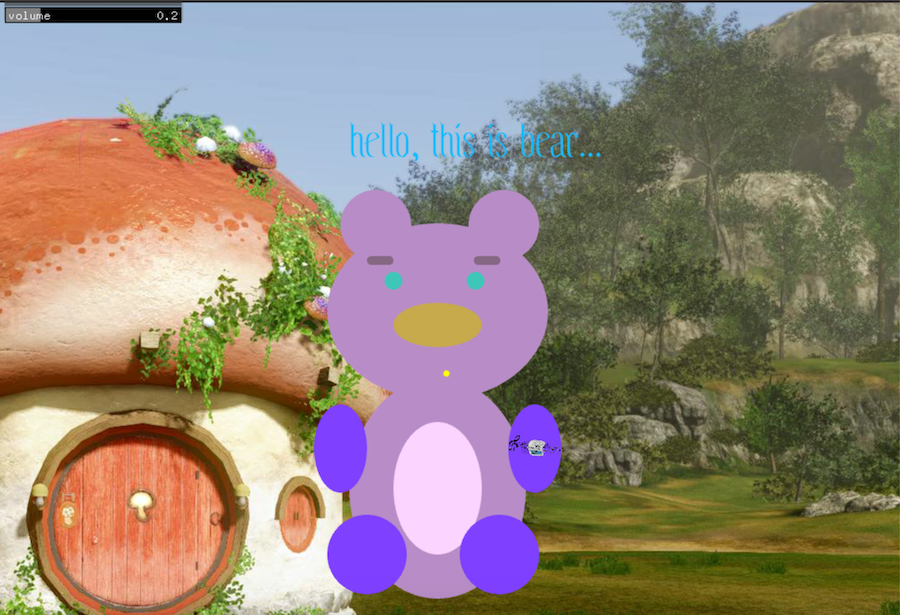
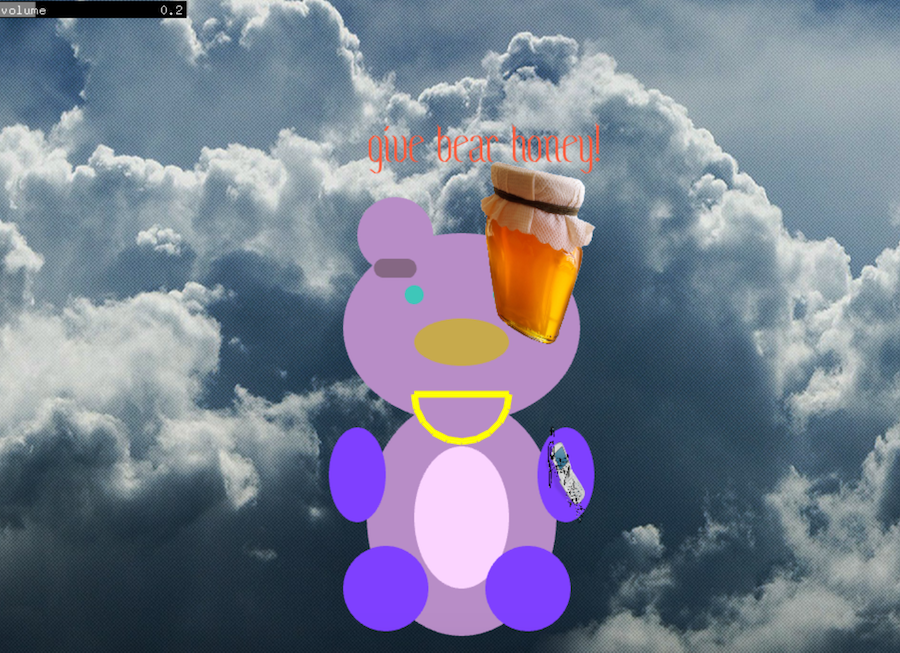
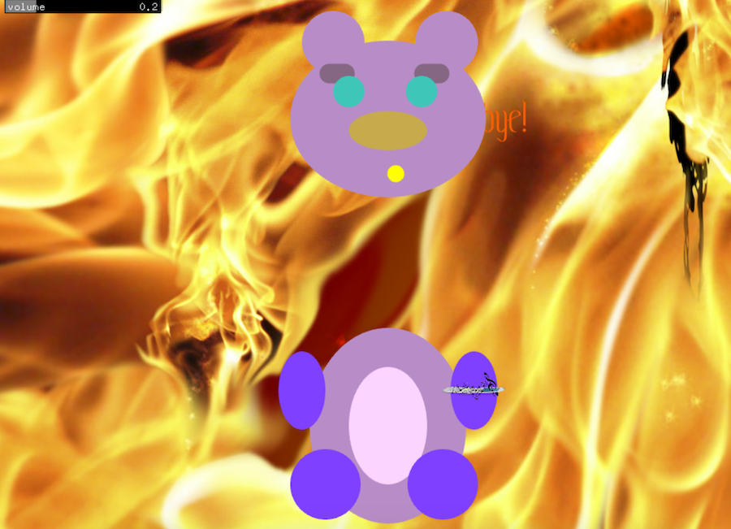

# Project One, Draft One

### concept

The concept was to make the story as simple as possible, so that I could really understand the basics of creating tied vectors and the ability to move those vectors. My goal was personal; to get a better understanding of timing and animation in code. 

For this reason, the story isn't super compelling; it's just a cute bear gets honey and goes a little crazy ;-) I just wanted to make something cute, and I want the "user" to just think bear is cute . The ideal user of my code I suppose would just be someone similarly novice who is just trying to get the basic logic of computer science and common equations in programming. 

### future iterations

I'm probably just going to add more scenes.  I might even make whole bear body move around or resize, or introduce another character.  I'm thinking about adding a 3D scene where I change bear into primatives after they eat the honey, so it's like bear enters a new dimension as a result of the honey eating.  

My immediate next step is to lerp the position of the eyebrows, so when the emotion changes, the whole face moves. I also want to rotate the arm so bear waves in the first scene. 

I also want to look into ofLerpColor, and change the color of the bear head. I might also look more into creating noise and taking the background images out and replacing them with generative patterns. There is truly so much more cool things one can do!

It would be nice to add interactions! For example, maybe this is the intro sequence to a game where you collect honey.

### process questions

1. Look into ofPath
2. Look into ofLerpColor
3. How to rotate the arm back & forth in the first scene ( I think I'm close in the logic of translating the center and rotating some degrees around the x-axis but I want to see more examples of this.)

### successes & shortcomings

successes: I feel like I'm finally understanding the basic logic of programming. I think it's also a personal success for me to have made something so basic, because I tend to have huge ideas. 

shortcomings: It takes me awhile, and I wish that it looked cooler I guess. I think I could still have a better understanding of timing. I need to add more polygons. The polyline mouth looks so werid. I want to make backgrounds more interesting. 

song is sleep walk by santo & johnny

link to video : https://youtu.be/o76sngsXo3k

